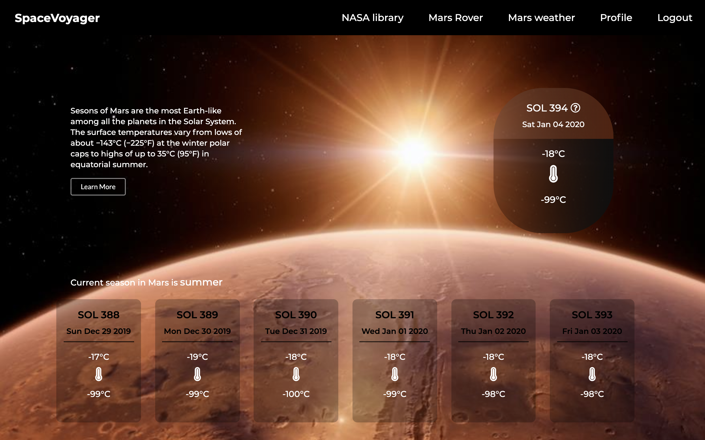

## SpaceVoyager frontend
SpaceVoyager is a fun exploring single page web application where you can browse media from the NASA library and photos from the Mars rover Curiosity's cameras. You can check out the weather in Mars for the past week and NASA's astronomy picture of the day as well!

### This is a repository for SpaceVoyager's frontend:
  - designed with Javascript and React + Redux
  - styled with Semantic UI framework and custom CSS
  - has full validations and authentication with JWT token
  - dynamically communicating with multiple NASA APIs by fetching to the backend
  
### To start the whole application, please clone both of spacevoyager-backend and spacevoyager-frontend
You can find backend at: https://github.com/kailey16/spacevoyager-backend

### To start this frontend repository:
  1. open and run 'npm install'
  2. run 'npm start'

#### To see a full demo, please look at: https://youtu.be/gCCKOJ1mQz8
   
